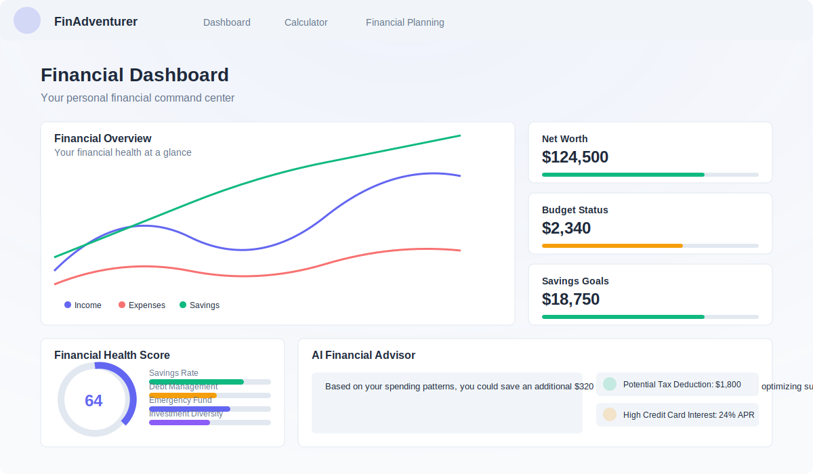

# Personal Finance App

A comprehensive personal finance web application built with Next.js 14, TypeScript, and Tailwind CSS. The app helps users manage their finances, track investments, receive AI-powered financial advice, and understand their financial health.



## Features

### Core Features
- **Financial Dashboard**: A comprehensive command center for monitoring all financial metrics
- **Authentication**: Secure user authentication system with protected routes
- **Financial Health Score**: Proprietary algorithm to calculate overall financial wellness 
- **AI Financial Advisor**: Personalized financial advice based on spending patterns and financial data
- **Investment Portfolio Tracker**: Track and visualize investment performance across different assets
- **Tax Insights**: Understand tax implications across different countries
- **Goals Progress**: Track progress toward financial goals and targets
- **Recent Transactions**: View and categorize recent financial activity

### Technical Features
- Modern React with Next.js 14 App Router
- TypeScript for type safety
- Responsive, mobile-friendly design with Tailwind CSS
- User authentication with Clerk
- Data visualization with Recharts
- Modern, accessible components with shadcn/ui
- Route protection with custom middleware

## Getting Started

### Prerequisites
- Node.js 18+ 
- npm or yarn

### Installation

1. Clone the repository
```bash
git clone https://github.com/yourusername/personal-finance-webapp.git
cd personal-finance-webapp
```

2. Install dependencies
```bash
npm install
# or
yarn install
```

3. Set up environment variables
Create a `.env.local` file with the following variables:
```
NEXT_PUBLIC_CLERK_PUBLISHABLE_KEY=your_clerk_publishable_key
CLERK_SECRET_KEY=your_clerk_secret_key
NEXT_PUBLIC_CLERK_SIGN_IN_URL=/auth
NEXT_PUBLIC_CLERK_SIGN_UP_URL=/auth
NEXT_PUBLIC_CLERK_AFTER_SIGN_IN_URL=/dashboard
NEXT_PUBLIC_CLERK_AFTER_SIGN_UP_URL=/dashboard
```

4. Run the development server
```bash
npm run dev
# or
yarn dev
```

5. Open [http://localhost:3000](http://localhost:3000) in your browser

## Project Structure

```
├── app/                  # Main app directory (Next.js App Router)
│   ├── auth/             # Authentication pages
│   ├── calculator/       # Tax calculator feature
│   ├── dashboard/        # Dashboard pages
│   ├── financial-planning/# Financial planning tools
│   └── page.tsx          # Landing page
├── components/           # Reusable components
│   ├── dashboard/        # Dashboard-specific components
│   ├── ui/               # UI components (shadcn/ui)
│   └── Header.tsx        # App header component
├── lib/                  # Utility functions and shared code
├── middleware.ts         # Auth middleware for protected routes
├── public/               # Static assets
└── styles/               # Global styles
```

## Technologies Used

- [Next.js 14](https://nextjs.org/)
- [TypeScript](https://www.typescriptlang.org/)
- [Tailwind CSS](https://tailwindcss.com/)
- [shadcn/ui](https://ui.shadcn.com/)
- [Clerk](https://clerk.dev/) - Authentication
- [Recharts](https://recharts.org/) - Data visualization
- [Lucide React](https://lucide.dev/) - Icons

## Future Enhancements

- Subscription management system
- Bill payment reminder system
- Financial document storage
- Multi-currency support
- Mobile app experience
- Real-time financial data integration
- Budget optimization with AI

## License

This project is licensed under the MIT License - see the LICENSE file for details.